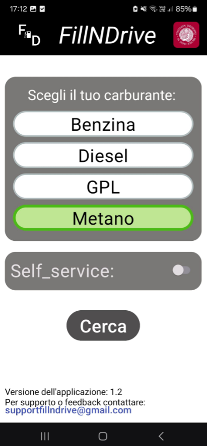
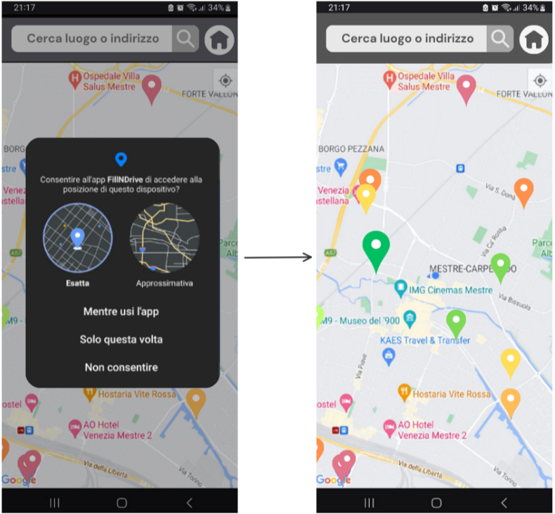

- **Homepage**
  Allows you to initially choose the type of fuel required and whether self-service is available.

  

- **Position**
  Requests permission to access your location and then shows all nearby gas stations with different colors indicating their convenience, highlighting the best one.

  

- **Route**
  Selecting a gas station displays all relevant information about it and also shows the route, with the option to open navigation in Google Maps.

  

- **Search**
  There is also the option to find gas stations using the search bar for a specific destination.

  
